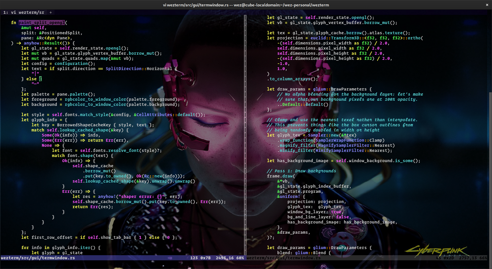

---
hide:
  - toc
---

*WezTerm 是一款功能强大的跨平台终端模拟器和多路复用器，由<a href="https://github.com/wez/">@wez</a>开发，并使用<a href="https://www.rust-lang.org/">Rust</a>实现。*

[Download :material-tray-arrow-down:](installation.md){ .md-button }

## Features

* 支持 Linux、macOS、Windows 10 和 FreeBSD
* [在本地和远程主机上多路复用终端窗格、标签页和窗口，并支持原生鼠标操作和滚动回溯。](multiplexing.md)
* <a href="https://github.com/tonsky/FiraCode#fira-code-monospaced-font-with-programming-ligatures">连字</a>, 支持连字、彩色 Emoji 和字体回退，提供真正的全彩色显示和[动态配色方案](config/appearance.md)。
* [超链接](hyperlinks.md)
* [完整的功能列表请参见此处](features.md)

查找[配置参考？](config/files.md)

**这些文档是可搜索的：按 `S` 键或点击放大镜图标来启用搜索功能！**

<figure markdown>

<figcaption>WezTerm 在 macOS 上运行 vim 的截图</figcaption>
</figure>
